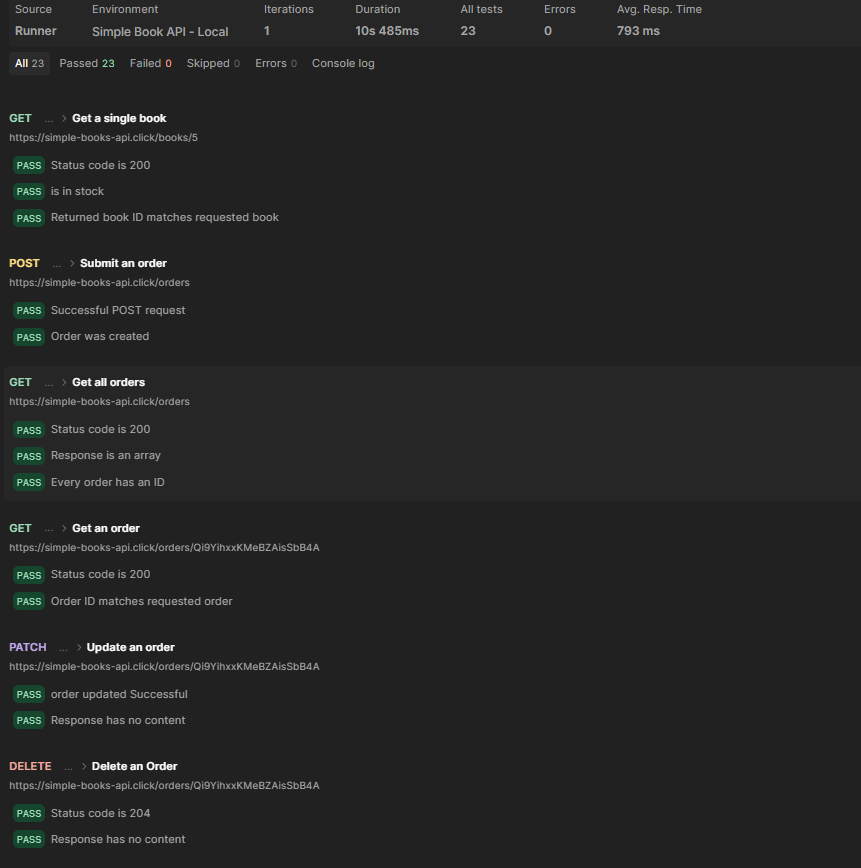
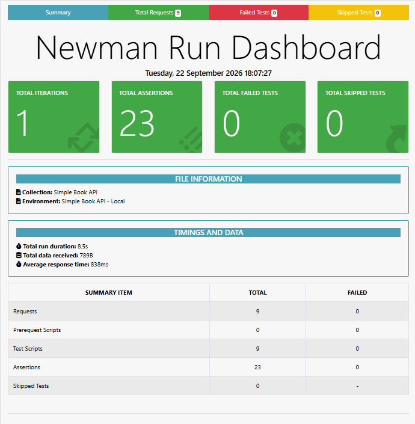

# Simple Books API Testing

Automated API testing project targeting the **Simple Books API**, built using Postman, Newman, and the Newman HTMLEXTRA reporter. This project does not implement the Books/Orders application itself — it tests and validates the behavior of its existing endpoints through automated assertions, environment-based configuration, scheduled monitoring, and Git-based collection management.

---

## Overview

This repository contains a Postman collection and environment used to test the Simple Books API. It validates health checks, authentication, book retrieval, and full order lifecycle operations (create, read, update, delete) exposed by the API. Test scripts are written in JavaScript within Postman and validate response status codes, response structure, and data correctness.

The project is version-controlled using **Postman Native Git integration**, keeping the Postman collection and environment synchronized with this GitHub repository.

---

## Objectives

- Demonstrate structured API test automation using Postman
- Validate core API operations for the Books and Orders resources, including create, read, update, and delete operations where supported
- Implement dynamic authentication token handling without committing secrets
- Automate test execution using Newman CLI
- Generate a readable, shareable HTML test report
- Configure scheduled test monitoring using Postman Monitor
- Maintain the project using Git and Postman Native Git integration

---

## Tools & Technologies

| Tool                      | Purpose                                                    |
| ------------------------- | ---------------------------------------------------------- |
| Postman                   | API request design, test scripting, collection management  |
| Postman Native Git        | Version control integration for the collection/environment |
| Git & GitHub              | Source control and repository hosting                      |
| Newman                    | CLI-based collection execution                             |
| Newman HTMLEXTRA Reporter | HTML test report generation                                |
| Postman Monitor           | Scheduled automated test execution                         |
| JavaScript                | Test assertions within Postman                             |

---

## API / Collection Structure

```
Simple Book API
├── Health check
│   └── API status
├── Authentication
│   └── Register API Client
├── Books
│   ├── List of Books
│   └── Get a single book
└── Orders
    ├── Submit an order
    ├── Get all orders
    ├── Get an order
    ├── Update an order
    └── Delete an Order
```

**Total requests:** 9

---

## API Endpoints Tested

| Folder         | Request             | Purpose                         |
| -------------- | ------------------- | ------------------------------- |
| Health check   | API status          | Verify API availability         |
| Authentication | Register API Client | Generate access token           |
| Books          | List of Books       | Retrieve all books              |
| Books          | Get a single book   | Retrieve a specific book by ID  |
| Orders         | Submit an order     | Create a new order              |
| Orders         | Get all orders      | Retrieve all orders             |
| Orders         | Get an order        | Retrieve a specific order by ID |
| Orders         | Update an order     | Update an existing order        |
| Orders         | Delete an Order     | Delete an existing order        |

---

## Environment Variables

**Environment:** `Simple Book API - Local`

| Variable      | Description                                    |
| ------------- | ---------------------------------------------- |
| `baseUrl`     | Base URL of the Simple Books API               |
| `accessToken` | Bearer token used for authenticated requests   |
| `bookID`      | ID of a book, used in book-related requests    |
| `orderID`     | ID of an order, used in order-related requests |

> **Note:** `accessToken` is intentionally left empty in the committed environment file. It is populated dynamically at runtime by the **Register API Client** request and is never committed with a real value.

---

## Automated Assertions

Each request includes post-response test scripts written in JavaScript. Examples of implemented validations:

**Register API Client**

- Status code is 201
- Access token is returned and is a non-empty string
- Generated access token is stored in the environment

**List of Books**

- Response is an array
- All returned books are non-fiction
- Every returned book has an ID

**Get a single book**

- Returned book ID matches the requested book ID

**Submit an order**

- Order creation response confirms the order was created

**Get all orders**

- Response is an array
- Every order has an ID

**Get an order**

- Returned order ID matches the requested order ID

**Update an order**

- Response has no content

**Delete an Order**

- Status code is 204
- Response has no content

---

## Test Execution Results

Full collection run summary:

| Metric               | Result |
| -------------------- | ------ |
| Requests executed    | 9      |
| Assertions/tests run | 23     |
| Failures             | 0      |
| Errors               | 0      |
| Skipped              | 0      |



---

## Postman Monitor

A Postman Monitor is configured for scheduled API test execution and health checks.

| Configuration    | Value                    |
| ---------------- | ------------------------ |
| Collection       | Simple Book API          |
| Environment      | Simple Book API - Local  |
| Schedule         | Daily at 5:00 PM         |
| Notifications    | Enabled on failure/error |
| Follow redirects | Enabled                  |
| SSL validation   | Enabled                  |

**Observed monitor status:**

| Metric            | Value   |
| ----------------- | ------- |
| Status            | Healthy |
| Runs              | 2       |
| Total requests    | 9       |
| Passed assertions | 23      |
| Failed tests      | 0       |
| Errors            | 0       |

This monitor performs scheduled test runs at the configured interval; it is not a continuous uptime monitoring solution.

---

## Newman CLI Execution

The main collection is maintained through **Postman Native Git** in Postman's v3 YAML format (under `postman/collections/`). Since Newman does not run this format directly, the collection was separately exported as a **Collection v2.1 JSON** file for local CLI execution.

**Execution flow:**

```
Postman Native Git collection (v3 YAML)
        │
        ▼
Exported Collection v2.1 JSON (local export, not committed)
        │
        ▼
Newman CLI execution
        │
        ▼
HTMLEXTRA report (newman-report.html)
```

| Item                     | Detail                                                                  |
| ------------------------ | ----------------------------------------------------------------------- |
| Native Git format        | Postman v3 YAML (source of truth, stored in this repository)            |
| Newman execution format  | Exported Collection v2.1 JSON (used locally only)                       |
| Exported collection file | `Simple Book API.postman_collection (1).json` (not committed to GitHub) |
| Environment used         | Exported environment JSON (used locally only)                           |

> The exported Collection v2.1 JSON and exported environment JSON are used only for local Newman execution and are **not part of this GitHub repository**.

Example command (paths are placeholders):

```bash
newman run "path/to/Simple Book API.postman_collection (1).json" \
  -e "path/to/Simple Book API - Local.postman_environment.json"
```

The Newman execution completed successfully against the exported collection.

---

## HTMLEXTRA Report

Newman's **HTMLEXTRA** reporter was used to generate a visual HTML report of the test execution.

- Report file: `newman-report.html`
- Generated using the sensitive-data protection flag: `--reporter-htmlextra-skipSensitiveData`

Example command:

```bash
newman run "path/to/Simple Book API.postman_collection (1).json" \
  -e "path/to/Simple Book API - Local.postman_environment.json" \
  -r htmlextra \
  --reporter-htmlextra-export newman-report.html \
  --reporter-htmlextra-skipSensitiveData
```

An initial report generation exposed runtime authentication data. The report was regenerated with the `skipSensitiveData` flag, manually reviewed for Bearer token / Authorization header exposure, and only the sanitized version was committed to this repository. `newman-report.html` resides at the repository root.



---

## Git & GitHub Workflow

- Repository: `simple-books-api-testing` (public)
- The Postman collection and environment are maintained through **Postman Native Git integration**, keeping the local Postman workspace, Postman cloud workspace, and this GitHub repository synchronized.
- Development is tracked using meaningful Git commits.


---

## Security Considerations

- Authentication tokens are never committed to this public repository.
- The `accessToken` value in the committed environment file is kept empty.
- The token is generated dynamically during test execution via the **Register API Client** request and exists only at runtime.
- The HTMLEXTRA report was sanitized (`--reporter-htmlextra-skipSensitiveData`) and manually checked for token/header exposure before being committed.
- Anyone reproducing this project should configure their own environment values rather than relying on committed data.

---

## Project Structure

```
simple-books-api-testing/
├── .git/
├── .postman/
│   └── resources.yaml
├── postman/
│   ├── collections/
│   │   └── Simple Book API/
│   │       ├── .resources/
│   │       ├── Authentication/
│   │       ├── Books/
│   │       ├── Health check/
│   │       └── Orders/
│   ├── environments/
│   │   └── Simple Book API - Local.environment.yaml
│   └── globals/
│       └── workspace.globals.yaml
├── newman-report.html
└── README.md
```

The Postman collection and environment are stored under `postman/`, managed through **Postman Native Git integration**. The exported Collection v2.1 JSON used for Newman execution is a local artifact only and is not committed to this repository.

---

## How to Run the Project

1. **Clone the repository**
   ```bash
   git clone <repository-url>
   ```
   ```bash
   cd simple-books-api-testing
   ```
2. **Open the project in Postman**
   Import the collection and environment, or sync via Postman Native Git integration if using a connected workspace.
3. **Configure the environment**
   Select the `Simple Book API - Local` environment and set `baseUrl` (and other variables as needed). Leave `accessToken` empty — it is generated at runtime.
4. **Do not hardcode the access token**
   Ensure `accessToken` remains empty in your local environment before running requests.
5. **Run the collection in Postman**
   Execute the **Register API Client** request first to generate the access token, then run the remaining requests or use the Postman Collection Runner.
6. **Export the collection and environment**
   Since Newman does not run the Native Git v3 YAML format directly, export the collection as Collection v2.1 JSON and export the environment as an environment JSON file. These exported files are used locally for Newman execution and are not committed to the repository.
7. **Run the exported collection using Newman**
   ```bash
   newman run "path/to/Simple Book API.postman_collection (1).json" \
     -e "path/to/Simple Book API - Local.postman_environment.json"
   ```
8. **Generate the HTMLEXTRA report**
   ```bash
   newman run "path/to/Simple Book API.postman_collection (1).json" \
     -e "path/to/Simple Book API - Local.postman_environment.json" \
     -r htmlextra \
     --reporter-htmlextra-export newman-report.html \
     --reporter-htmlextra-skipSensitiveData
   ```

---

## Future Improvements / Possible Extensions

The following are potential future improvements and are **not currently implemented**:

- Negative and edge-case test scenarios
- Response-time / performance assertions
- CI pipeline integration
- Data-driven testing using external data files

---

## Author

**Ishika Gupta**  
B.Tech CSE Student | Backend Development & API Testing

This project is maintained as part of my software development and API testing portfolio.
